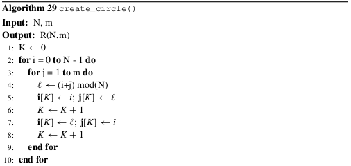
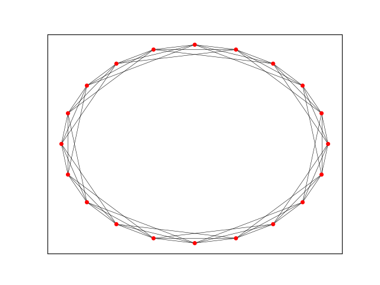
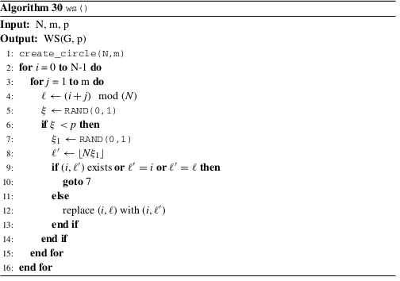
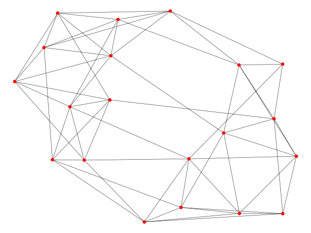

#  The Watts–Strogatz Small-World Model

Se presenta la implementación de un algoritmo que construye gráficas de mundo pequeño de acuerdo al modelo Watts–Strogatz. 

## Descripción de problema:
Watts y Strogatz (1998) presentan un modelo para construir redes de mundo pequeño.

El algoritmo comienza definiendo una gráfica regular en forma de un anillo con n vértices y m aristas por vértices.

 

Posteriormente, se reconectan las aristas de forma aleatoria con una probabilidad p. Cuando p=0, no hay reconexión,así que la red queda como anillo, es decir, un red regular. En el caso que $p=1$, la reconexión de las aristas genera una red aleatoria. Para valores intermedios 0<p<1, se genera una red de mundo pequeño.

 

Refencia:
Latora, V., Nicosia, V., and Russo, G. (2017). Complex networks: principles, methods
and applications. Cambridge University Press.
Inicialmente se construye una gráfica circular con el siguiente algoritmo:


Posteriormente implementamos el sigueinte algoritmo para construir la gráfica de mundo pequeño Watts–Strogatz.
 
 
### Compilar


```
nvcc watts_strogatz.cu -o watts_strogatz
```

### Ejecutar
```
./watts_strogatz n m p threads
```
Donde:

   * n: es la cantidad de vértices de la red
   * m: es la cantidad de vértices vecinos con los que se conecta cada nodo
   * p: es la probabilidad de reconexión
   * threads: es la cantidad de hilos por bloque de la dimensión x
    